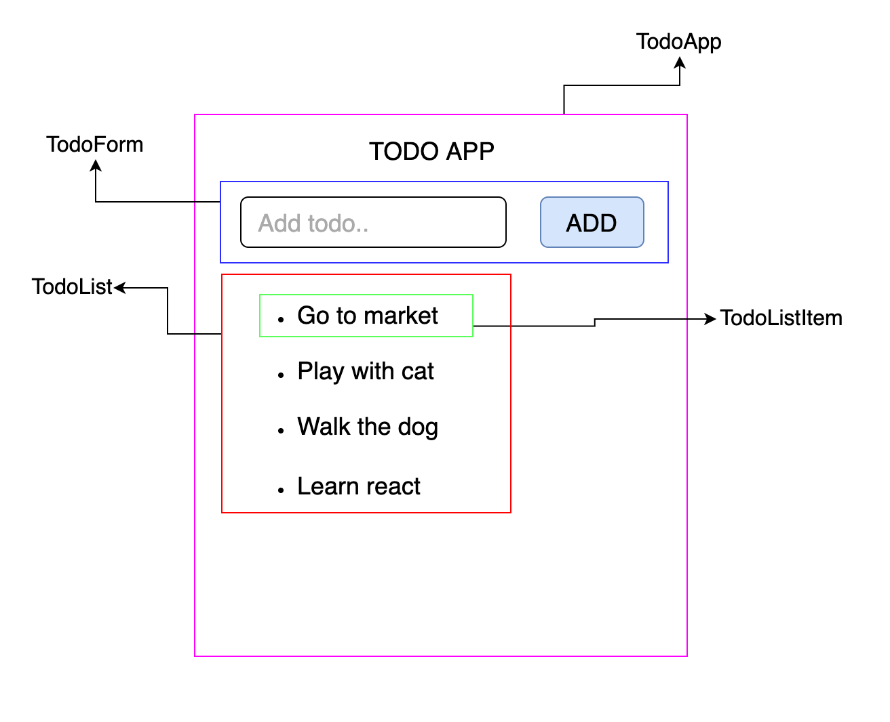
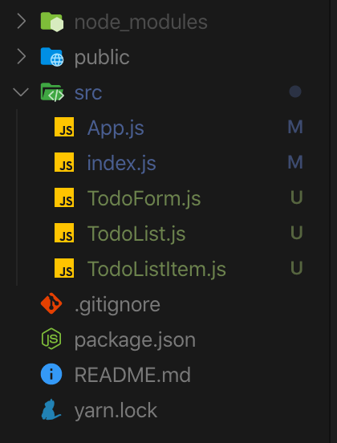
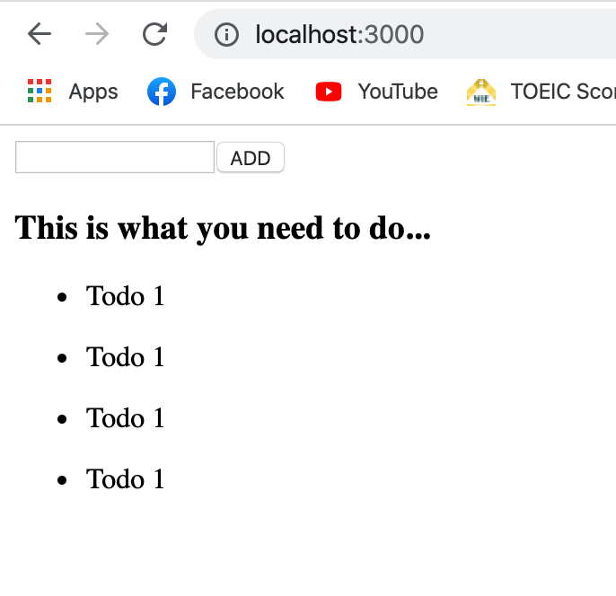

# Introduction to React.js

_A JavaScript library for building user interfaces._ React is a declarative library that can create interactive UIs that will efficiently update and render just the right components when data changes. React can build encapsulated components that manage their own state, then compose them to make complex UIs.

## Components

Component is the main building blocks of React. Components let you split the UI into independent, reusable pieces, and think about each piece in isolation.

There are 2 ways to create React components, the first one is "Class components" and the second one is "Functional components"

```javascript
// Class components
class Welcome extends React.Component {
  render() {
    return <h1>Hello</h1>;
  }
}

// Functional components
function Hello {
    return <h1>Hello</h1>;
}

// or with ES6 Arrow function
const Hello = () => {
  return <h1>Hello</h1>;
}
```

Let's see some example with a todo list app using react components principle.



- `TodoListItem` component that can be reused for each todo item in the list.
- `TodoList` component that contains list of all the todo items.
- `TodoForm` component that allow user to add new todo item.
- `TodoApp` component that uses all components as above to create entire application.

Here is how we create and nested our components in React.

I'll create 4 React components `TodoListItem.js`, `TodoList.js`, `TodoForm.js` and `App.js` like this:



then inside each components, we'll use JSX just like this.

```JSX
// TodoListItem
import React from 'react';

const TodoListItem = () => {
  return (
    <div>
      <ul>
        <li>Todo 1</li>
      </ul>
    </div>
  );
};

export default TodoListItem;
```

```JSX
// TodoList
import React from 'react';
import TodoListItem from './TodoListItem';

const TodoList = () => {
  return (
    <div>
      <h3>This is what you need to do...</h3>
      <TodoListItem />
      <TodoListItem />
      <TodoListItem />
      <TodoListItem />
    </div>
  );
};

export default TodoList;
```

```JSX
// TodoForm
import React from 'react';

const TodoForm = () => {
  return (
    <div>
      <form action="">
        <input type="text" />
        <button>ADD</button>
      </form>
    </div>
  );
};

export default TodoForm;
```

```JSX
// App.js
import React from 'react';
import TodoForm from './TodoForm';
import TodoList from './TodoList';

const App = () => {
  return (
    <div>
      <TodoForm />
      <TodoList />
    </div>
  );
};

export default App;
```

and here is what we will see in the browser.



This is just a simple example to give you a better understanding how we use components in React app. To create more complex react application, we need to understand `JSX` syntax that I will explain in the next section.
