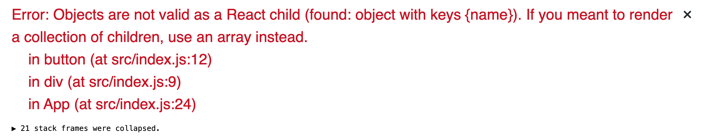

# Introducing to JSX

JSX is s a "Javascript syntax extension" that allows you to write HTML and CSS inside react application. JSX may remind you of a template language, but it comes with the full power of JavaScript.

## A taste of JSX

JSX syntax is look like this:

```javascript
import React from 'react';
import ReactDOM from 'react-dom';

const App = () => {
  return (
    <div>
      <label>Enter name:</label>
      <input type="text" />
      <button>Submit</button>
    </div>
  );
};

ReactDOM.render(<App />, document.getElementById('root'));
```

Here is a couple things you need to know about JSX

- It's not 100% HTML.
- Browser does not understand JSX code, we need a tool to convert it then browser can understand. We do need [babeljs playground](https://babeljs.io/repl#?browsers=&build=&builtIns=false&spec=false&loose=false&code_lz=MYewdgzgLgBAggBwTAvDAFASlQPhgbwCgYYAnAUygFdSwNiSYAeAEwEsA3HBx5gGwCGAI3J8cAUTBRypGGAEBbcgC4mAekEixPRkzZgEVWFACeCcigBE0gB5RLMNd14kmQo1HA4AylSEK2KHV3KE8wZ101di4GTABuQgBfOKA&debug=false&forceAllTransforms=false&shippedProposals=false&circleciRepo=&evaluate=false&fileSize=false&timeTravel=false&sourceType=module&lineWrap=true&presets=es2015%2Creact%2Cstage-2&prettier=true&targets=&version=7.9.0&externalPlugins=)
- There are couple differences when using HTML properties with JSX.
  - You cannot use `for` properties use `htmlFor` instead
  - You have to use `className` instead of `class` property.

and here is how we style `css` in JSX

```javascript
const App = () => {
  return (
    <div>
      <label>Enter name:</label>
      <input type="text" />
      <button
        style={{
          color: 'white',
          backgroundColor: 'blue'
        }}
      >
        Submit
      </button>
    </div>
  );
};
```

## Referencing JavaScript variables

We also refer to javascript variables in JSX by put variable name inside `{varName}` like this:

```javascript
const App = () => {
  const btnText = 'CLICK ME';
  return (
    <div>
      <label>Enter name:</label>
      <input type="text" />
      <button
        style={{
          color: 'white',
          backgroundColor: 'blue'
        }}
      >
        {btnText}
      </button>
    </div>
  );
};
```

here is what is displayed in the browser.


or you reference to function calls like this:

```javascript
function getBtnText() {
  return 'Hi, there!';
}

const App = () => {
  return (
    <div>
      <label>Enter name:</label>
      <input type="text" />
      <button
        style={{
          color: 'white',
          backgroundColor: 'blue'
        }}
      >
        {getBtnText()}
      </button>
    </div>
  );
};
```

but there are some limitations about referencing variable inside JSX, first you can't refer to the object.

```javascript
const App = () => {
  const obj = {
    name: 'Foo'
  };

  return (
    <div>
      <label>Enter name:</label>
      <input type="text" />
      <button
        style={{
          color: 'white',
          backgroundColor: 'blue'
        }}
      >
        {obj}
      </button>
    </div>
  );
};
```

then you'll get the error



You might think, how about `style` properties in `button` element it look like javascript object. Well, technically we still can use javascript object inside JSX **_as long as we don't reference them directly to JSX element_**

I'll reference `style` properties with the javascript variable like this:

```javascript
const App = () => {
  const btnText = 'CLICK ME';
  const btnStyle = {
    color: 'white',
    backgroundColor: 'blue'
  };

  return (
    <div>
      <label>Enter name:</label>
      <input type="text" />
      <button style={btnStyle}>{btnText}</button>
    </div>
  );
};
```

## Conditional rendering in JSX

This is working the same way we write in JavaScript. Use JavaScript operators like `if` or the `conditional operator` to create elements representing the current state, and let React update the UI to match them.

```javascript
// ternary operators
const App = () => {
  const num = Math.floor(Math.random() * 10);

  return (
    <div>
      <h1>Your Number is: {num}</h1>
      <h1>{num === 7 ? 'Congratulations!' : 'Not that number'}</h1>
    </div>
  );
};
```

Let's check at the browser


then if our number is matched


