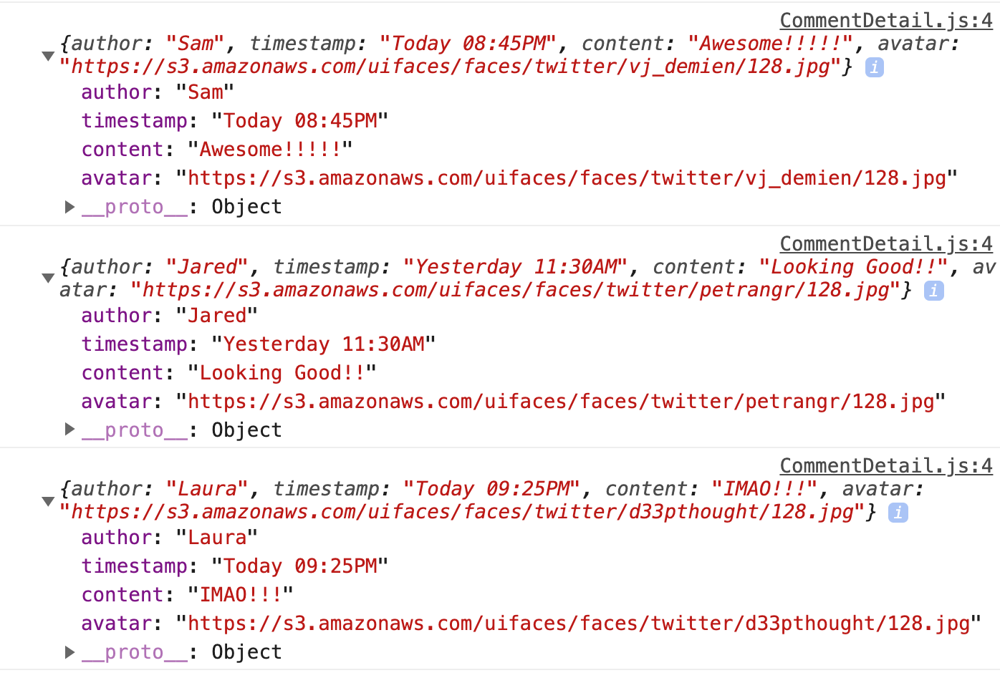
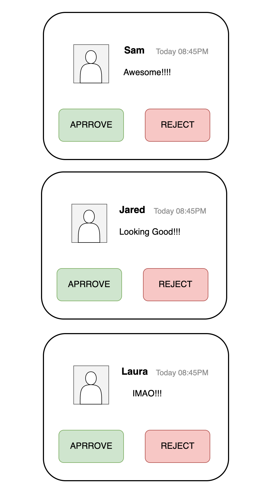
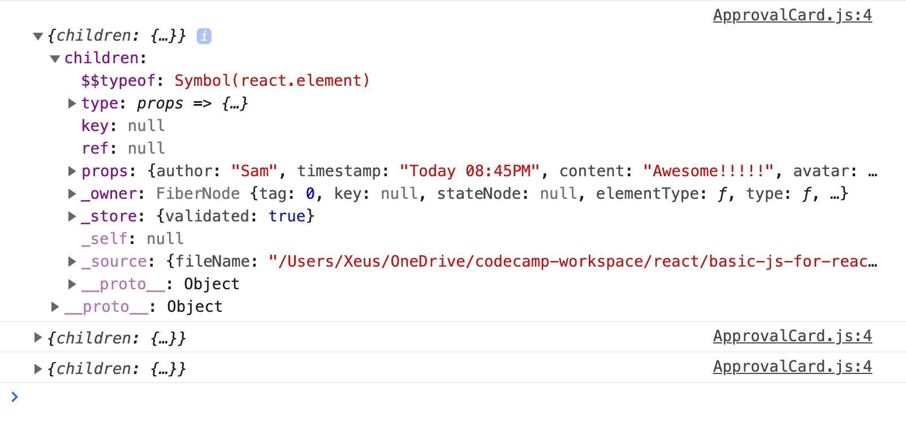
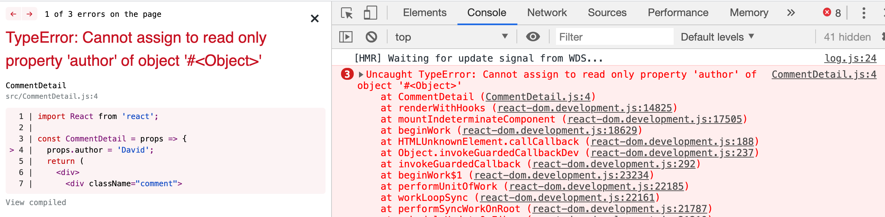

# Props

Props is stand for properties, props in react is a system for passing data from a parent component to a child component (or a nested component). Then we can make it easy to reusable.

OK, let's see the example. Suppose we have a component nested like this.

*note: I have used a library called `faker.js` for dummy data also semantic-ui for ui*

```JSX
// index.js
import React from 'react';
import ReactDOM from 'react-dom';
import CommentDetail from './CommentDetail.js';

const App = () => {
  return (
    <div className="ui container comments">
      <CommentDetail />
    </div>
  );
};

ReactDOM.render(<App />, document.getElementById('root'));
```

and `CommentDetail.js`

```JSX
import React from 'react';
import faker from 'faker';

const CommentDetail = () => {
  return (
    <div>
      <div className="comment">
        <a href="/" className="avatar">
          
        </a>
        <div className="content">
          <a href="/" className="author">
            Sam
          </a>
          <div className="metadata">
            <span className="date">Today 5:00PM</span>
          </div>
          <div className="text">Wowww! That's great!</div>
        </div>
      </div>
      <div className="comment">
        <a href="/" className="avatar">
          
        </a>
        <div className="content">
          <a href="/" className="author">
            Jared
          </a>
          <div className="metadata">
            <span className="date">Yesterday 9:30AM</span>
          </div>
          <div className="text">Looking Good!!!</div>
        </div>
      </div>
      <div className="comment">
        <a href="/" className="avatar">
          
        </a>
        <div className="content">
          <a href="/" className="author">
            Laura
          </a>
          <div className="metadata">
            <span className="date">Yesterday 7:20PM</span>
          </div>
          <div className="text">That's Awesome!</div>
        </div>
      </div>
    </div>
  );
};

export default CommentDetail;
```

 As you can see, we have a duplicate code for the comment's component. Here is how we can make use of the props system in React.

 Let's re-write `App` component in `index.js` and I'll add `props` to the `CommentDetail` component like so:

```JSX
const App = () => {
  return (
    <div className="ui container comments">
      <CommentDetail
        author="Sam"
        timestamp="Today 08:45PM"
        content="Awesome!!!!!"
        avatar={faker.image.avatar()}
      />
      <CommentDetail
        author="Jared"
        timestamp="Yesterday 11:30AM"
        content="Looking Good!!"
        avatar={faker.image.avatar()}
      />
      <CommentDetail
        author="Laura"
        timestamp="Today 09:25PM"
        content="IMAO!!!"
        avatar={faker.image.avatar()}
      />
    </div>
  );
};
```

Back to `CommentDetail.js`, we need to get access to our props that we've provided in `index.js` file. That `props` is going to show up inside of an object that is provided as the first argument to this function.

```javascript
const CommentDetail = (props) => {...}
```

Let's log `props` in the console and see what is look like

```JSX
const CommentDetail = props => {
  console.log(props);
  ...
};
```

here is what is logged in the console.



Then you'll see `key: value` pairs that we've provided. In order to use `props` and render it in `CommentDetail` component, we can reference it inside `{}` like this:

```JSX
import React from 'react';

const CommentDetail = props => {
  return (
    <div>
      <div className="comment">
        <a href="/" className="avatar">
          
        </a>
        <div className="content">
          <a href="/" className="author">
            {props.author}
          </a>
          <div className="metadata">
            <span className="date">{props.timestamp}</span>
          </div>
          <div className="text">{props.content}</div>
        </div>
      </div>
    </div>
  );
};

export default CommentDetail;
```

And our result still working as expected.


## Component Reusable

Suppose we want to create a card component with 2 buttons `APPROVE` and `REJECT` like this:



The goal is we need to wrap each of our components with 2 additional buttons underneath it. Actually, we can do this by add more JSX code in `CommentDetail.js` file but I will show you the different way to do this with `props.children`

We have to create one more component called `ApprovalCard.js` and wrap all `CommentDetail` inside it.

```JSX
// ApprovalCard.js
import React from 'react';

const ApprovalCard = () => {
  return (
    <div className="ui card">
      <div className="content"></div>
      <div className="extra content">
        <div className="ui two buttons">
          <div className="ui basic green button">Approve</div>
          <div className="ui basic red button">Reject</div>
        </div>
      </div>
    </div>
  );
};

export default ApprovalCard;
```

and here is in `index.js` file

```JSX
import React from 'react';
import ReactDOM from 'react-dom';
import CommentDetail from './CommentDetail';
import ApprovalCard from './ApprovalCard';
import faker from 'faker';

const App = () => {
  return (
    <div className="ui container comments">
      <ApprovalCard>
        <CommentDetail
          author="Sam"
          timestamp="Today 08:45PM"
          content="Awesome!!!!!"
          avatar={faker.image.avatar()}
        />
      </ApprovalCard>
      <ApprovalCard>
        <CommentDetail
          author="Jared"
          timestamp="Yesterday 11:30AM"
          content="Looking Good!!"
          avatar={faker.image.avatar()}
        />
      </ApprovalCard>
      <ApprovalCard>
        <CommentDetail
          author="Laura"
          timestamp="Today 09:25PM"
          content="IMAO!!!"
          avatar={faker.image.avatar()}
        />
      </ApprovalCard>
    </div>
  );
};

ReactDOM.render(<App />, document.getElementById('root'));
```

Back to our `ApprovalCard.js` and let's log `props` in the console.

```JSX
import React from 'react';

const ApprovalCard = props => {
  console.log(props);
  return (
    <div className="ui card">
      <div className="content"></div>
      <div className="extra content">
        <div className="ui two buttons">
          <div className="ui basic green button">Approve</div>
          <div className="ui basic red button">Reject</div>
        </div>
      </div>
    </div>
  );
};

export default ApprovalCard;
```

Let's look at the `props` object, then you can see `props` has single one property called `children` that contains our `CommentDetail` properties.



So essentially when we pass one component to another using this syntax as above. The `child component` in this case is `CommentDetail` is going to show up inside of the `ApprovalCard` on the prop's object and especifically on a property of the prop's object called the `children property` see code below for what I'm talking about.

```JSX
<ApprovalCard> // parent component
    <CommentDetail /*child component*/
        author="Sam"
        timestamp="Today 08:45PM"
        content="Awesome!!!!!"
        avatar={faker.image.avatar()}
    />
</ApprovalCard>
```

and in our `ApprovalCard.js` we can render content from `props` just like this:

```JSX
import React from 'react';

const ApprovalCard = props => {
  return (
    <div className="ui card">
      <div className="content">{props.children}</div>
      <div className="extra content">
        <div className="ui two buttons">
          <div className="ui basic green button">Approve</div>
          <div className="ui basic red button">Reject</div>
        </div>
      </div>
    </div>
  );
};

export default ApprovalCard;
```

Here is what we expected to see in the browser.


## Props are Immutable

Props are immutable, they don't change and you cannot change them. It doesn't mean your data in application can never change but we don't do this through `props` at least we don't manually change it.

For example in `CommentDetail.js` file, if I try to change `props.author = 'David'` see what we get



I got a nasty error `Uncaught TypeError: Cannot assign to read only property 'author' of object`
